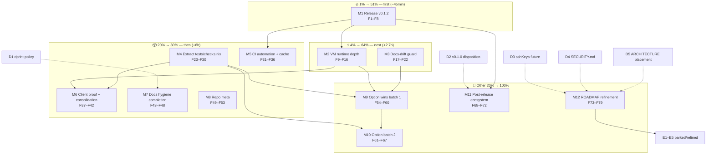

# Pareto Execution Plan 2 — nix-ssh-config (Release & Prove)

**Date:** 2026-08-29 13:52 CEST
**Inputs:** `TODO_LIST.md` (16 open rows), `ROADMAP.md` (6 themes, 4 open
questions), status report `docs/status/2026-08-29_13-41_docs-health-pass-2-harvest-and-archive.md` (f/1–50),
and the repo state: issue #1 fixed and committed (`5b54f76`) but **unreleased**;
no GitHub Release objects; CI green on last push.
**Customer:** downstream NixOS / Home Manager consumers (primary: the
maintainer's own machines, e.g. `nix-international-telephony`).
**Method:** Pareto planning — 1% → 51%, 4% → 64%, 20% → 80%, remaining 20% → 100%.
**Baseline:** master at `9060fed`, tree clean, gates green.

---

## Step 1 — Pareto Breakdown

### The 1% that delivers 51% (~45min, 1 task)

**Ship what already exists.** The keyboard-interactive fix (issue #1) is the
first real security bugfix in this flake's history — and it is sitting in two
local commits. Until it is tagged, pushed, and released: every consumer keeps
the vulnerable default, `nix-international-telephony` keeps its workaround,
issue #1 stays open, and the repo has zero GitHub Release objects (verified
2026-08-29: `gh release list` is empty — v0.1.0/v0.1.1 exist only as tags).
One release motion fixes the security exposure, the paper trail, and the
trust signal simultaneously.

| ID | What                                   | Why it is 51%                                                                                                                                 | Effort |
| -- | -------------------------------------- | ---------------------------------------------------------------------------------------------------------------------------------------------- | ------ |
| M1 | **Release v0.1.2 end-to-end**          | The fix reaches consumers; issue #1 closes with evidence; Release objects exist for the first time; downstream unpin becomes possible. Everything else in this plan is worth more after this exists. | 45min  |

### The 4% that delivers 64% (adds ~2.7h, 2 tasks)

**Prove the headline claims.** The README's most quotable promises —
post-quantum KEX actually negotiated, hardened defaults actually enforced,
banner actually served — are currently proven only server-side as config
fragments (`sshd -T` greps), not as runtime behavior. And the docs have
drifted three times ("13 checks", ghost conventions, "matrix above"); nothing
catches it mechanically yet.

| ID | What                              | Why the next 13%                                                                                                                                        | Effort |
| -- | --------------------------------- | -------------------------------------------------------------------------------------------------------------------------------------------------------- | ------ |
| M2 | **VM runtime depth**              | Assert the *negotiated* KEX is `mlkem768x25519-sha256` (`ssh -vv`), cross-check `ssh -Q` vs sshd support, prove a wrong key is rejected and the banner is actually delivered. The PQ headline becomes a tested fact, not a claim. | 100min |
| M3 | **Docs-drift guard**              | Eval check that every README option-table row exists in the modules (and counts match `builtins.attrNames checks`). Mechanically kills the drift class that produced "13 checks", the ghost convention, and the broken table cell. | 60min  |

### The 20% that delivers 80% (adds ~6h, 5 tasks)

**Maintainability, automation, and the remaining proof.** `flake.nix` at ~740
lines makes every future test addition expensive; CI has no dependency
automation or cache fallback; the client module still has zero runtime proof;
docs hygiene is one blocked decision away from being finished forever.

| ID | What                                        | Why the next 16%                                                                                              | Effort |
| -- | ------------------------------------------- | -------------------------------------------------------------------------------------------------------------- | ------ |
| M4 | **Extract `tests/checks.nix`**              | flake.nix shrinks to ~200 lines; test work stops requiring spelunking a 740-line file. Debt actively grew all month. | 90min  |
| M5 | **CI automation + cache robustness**        | Dependabot for pinned Actions, weekly flake.lock PRs, combined checks-summary job, cache fallback + `cache.home.lan` 502 investigation. CI stops rotting silently. | 80min  |
| M6 | **Client runtime proof + test consolidation** | `ssh -G` + rendered-config-text checks (client's first runtime proof), dedupe the two weak `deepSeq` checks, `sshd -T` golden snapshot. | 80min  |
| M7 | **Docs hygiene completion**                 | Execute the dprint decision (D1), strikethrough-balance lint, README badges, record the annotation convention — docs hygiene becomes self-enforcing. | 60min  |
| M8 | **Repo meta**                               | CODEOWNERS, issue/PR templates, pre-push gate hook. First-impression and contributor-intake work.              | 45min  |

### The other 20% → 100% (~5.5h + parked epics)

Depth, reach, and the long tail — most gated on the release and the decisions.

| ID    | What                                                    | Value                                                                                  | Effort |
| ----- | -------------------------------------------------------- | ---------------------------------------------------------------------------------------- | ------ |
| M9    | Option wins batch 1 (small, self-contained)              | `sntrup761x25519-sha512` IANA alias, `LoginGraceTime` default doc, `listenAddresses`, `knownHosts` passthrough, `certificateFile`, per-user keys example | 70min  |
| M10   | Option batch 2 (design-heavy)                            | `UsePAM` passthrough, `AuthenticationMethods` (chained 2FA), client keepalive/ControlMaster/UpdateHostKeys options, `PerSourcePenalties`/`MaxStartups` defaults | 100min |
| M11   | Post-release ecosystem                                   | Retire the downstream workaround, `nix flake update` + cadence decision, release-automation flow | 60min  |
| M12   | ROADMAP refinement/parking (E1–E5 + process)             | darwinModules, age/sops design, overlay pin, multi-node test, ML-DSA/matrix watch cadences, prompt-path test design, table-driven fixtures, upstream annotation tooling PR, `nixos-generate-config` study | 90min  |

**Decisions (BLOCKED, need maintainer — 5min each):**

| ID | Question                                       | Recommendation                                                                                          |
| -- | ----------------------------------------------- | -------------------------------------------------------------------------------------------------------- |
| D1 | dprint: wire into treefmt or drop `dprint.json`? | **Wire it** — enforced markdown formatting kills the table-drift class; re-verify strikethrough integrity in archives afterward. |
| D2 | v0.1.0 disposition (headline feature was runtime-broken) | **Leave it** — CHANGELOG warns, compare links intact; rewriting history hurts anyone who pinned.   |
| D3 | Keep personal pubkeys as public `sshKeys` output? | **Keep** — public keys are public; the output is load-bearing in the README quick-start.                |
| D4 | SECURITY.md vs README-owned threat model        | **Keep README canonical** (single-home), add `SECURITY.md` only as a pointer with contact/disclosure policy. |
| D5 | ARCHITECTURE: own file or stay in AGENTS.md?    | **Stay in AGENTS.md** — one consumer (AI sessions + maintainers); a separate file is ceremony at this size. |

---

## Step 2 — Comprehensive Plan (30–100min tasks, sorted by importance/impact/effort/customer-value)

| #  | ID  | Task (bundle)                                                              | Covers TODO(s)            | Pareto tier | Impact | Effort | Customer value                                        |
| -- | --- | --------------------------------------------------------------------------- | --------------------------- | ----------- | ------ | ------ | ------------------------------------------------------- |
| 1  | M1  | Release v0.1.2: date changelog, tag, push, Release objects ×3, issue #1 close-out | TODO Release & remote      | 1%          | High   | 45min  | The security fix ships; trust + paper trail restored    |
| 2  | M2  | VM runtime depth: negotiated KEX, `ssh -Q`, wrong-key, banner delivery     | TODO Test depth ×4         | 4%          | High   | 100min | "Hardened + post-quantum" becomes runtime-proven        |
| 3  | M3  | Docs-drift guard: README options ↔ modules, counts ↔ attrNames             | TODO Test depth            | 4%          | High   | 60min  | Docs stop lying mechanically                            |
| 4  | M4  | Extract `tests/checks.nix`                                                  | TODO Refactoring           | 20%         | Med    | 90min  | Every future test task gets cheaper                     |
| 5  | M5  | CI automation + cache robustness                                            | TODO CI automation/cache   | 20%         | Med    | 80min  | CI stays green without manual babysitting               |
| 6  | M6  | Client runtime proof + dedupe + golden snapshot                             | TODO Test depth/Refactoring | 20%         | Med    | 80min  | Client module finally runtime-proven                    |
| 7  | M7  | Docs hygiene completion (dprint execution, lint, badges, conventions)       | TODO Decisions/Low         | 20%         | Med    | 60min  | Docs formatting + integrity self-enforcing              |
| 8  | M8  | Repo meta: CODEOWNERS, templates, pre-push hook                             | TODO Low                   | 20%         | Low    | 45min  | Contributor intake works                                |
| 9  | M9  | Option wins batch 1                                                         | ROADMAP theme 5            | other 20%   | Med    | 70min  | Common asks covered without escape hatches              |
| 10 | M10 | Option batch 2 (design-heavy)                                               | ROADMAP theme 5            | other 20%   | Med    | 100min | 2FA and PAM-less setups become first-class              |
| 11 | M11 | Post-release ecosystem                                                      | ROADMAP themes 2/6         | other 20%   | Med    | 60min  | Downstream simplifies; inputs stay fresh                |
| 12 | M12 | ROADMAP refinement/parking (E1–E5, watch cadences, process)                 | ROADMAP themes 1–6         | other 20%   | Low    | 90min  | Long-term direction stays actionable, not vague         |
| 13 | D1  | Decision: dprint policy                                                     | TODO Decisions             | gate        | Med    | 5min   | Unblocks M7                                             |
| 14 | D2  | Decision: v0.1.0 disposition                                                | ROADMAP open questions     | gate        | Low    | 5min   | Closes a standing question                              |
| 15 | D3  | Decision: `sshKeys` output future                                           | ROADMAP open questions     | gate        | Low    | 5min   | Closes a standing question                              |
| 16 | D4  | Decision: SECURITY.md                                                       | ROADMAP open questions     | gate        | Low    | 5min   | Closes a standing question                              |
| 17 | D5  | Decision: ARCHITECTURE placement                                            | ROADMAP open questions     | gate        | Low    | 5min   | Closes a standing question                              |

**Sort rationale:** ship (M1) before prove (M2/M3) because an unshipped fix
makes proof academic; prove before grow (M9/M10) because new options must
land on a verified base; refactor (M4) before the option batches so new tests
go into the clean structure, not the 740-line flake. D1 gates M7; D2–D5 float
(5min each, unblock nothing).

---

## Step 3 — Fine Breakdown (≤12min per task, sorted within tiers)

### Tier 1% → 51%

| #  | Fine task                                                                     | Parent | Effort | Verify by                                   |
| -- | ------------------------------------------------------------------------------- | ------ | ------ | --------------------------------------------- |
| F1 | Push master (`5b54f76`, `9060fed`) and watch both CI jobs green                 | M1     | 10min  | `gh run list`: success on both jobs           |
| F2 | Date the `CHANGELOG.md` `[Unreleased]` section as `0.1.2 — 2026-08-29`          | M1     | 5min   | diff shows dated section                      |
| F3 | Create annotated tag `v0.1.2` and push tag + master                             | M1     | 5min   | `git tag -l` + tag visible on GitHub          |
| F4 | Verify CI green on the tag push                                                 | M1     | 10min  | run conclusion = success                      |
| F5 | `gh release create v0.1.2` from the annotated tag message                       | M1     | 12min  | Release page renders notes                    |
| F6 | Backfill Release objects for v0.1.0 and v0.1.1 from their tag messages          | M1     | 12min  | `gh release list` shows three releases        |
| F7 | Comment on issue #1: verification summary, fix, PAM nuance, v0.1.2 pointer      | M1     | 10min  | comment visible with evidence                 |
| F8 | Close issue #1 referencing v0.1.2                                               | M1     | 2min   | issue state = closed                          |

### Tier 4% → 64%

| #  | Fine task                                                                        | Parent | Effort | Verify by                                     |
| -- | ---------------------------------------------------------------------------------- | ------ | ------ | ----------------------------------------------- |
| F9 | VM subtest: `ssh -vv` client run asserts `kex: algorithm: mlkem768x25519-sha256`  | M2     | 12min  | subtest passes; new assertion in testScript   |
| F10 | VM subtest: `ssh -Q` output ⊇ our Ciphers/MACs/Kex lists (runtime support proof) | M2     | 12min  | subtest passes                                |
| F11 | Kill-switch F9/F10 (drop mlkem from crypto.nix → VM red)                          | M2     | 12min  | deliberate break fails the run, then restore  |
| F12 | VM subtest: wrong-key login rejected (exit ≠ 0, `Permission denied`)              | M2     | 12min  | subtest passes                                |
| F13 | VM subtest: client observes pre-auth banner text                                  | M2     | 12min  | subtest passes                                |
| F14 | Kill-switch F12/F13 (re-enable kbd → wrong-key path changes; empty banner → red)  | M2     | 12min  | deliberate breaks trip, then restore          |
| F15 | Full gate with VM evidence: `nix build -L` the VM drv, inspect per-subtest lines  | M2     | 12min  | green run with readable transcript            |
| F16 | CHANGELOG `[Unreleased]`/FEATURES rows for the new subtests                       | M2     | 8min   | docs match new assertions                     |
| F17 | Eval helper: option inventory from both modules (`mkNixosEval`/`mkHmEval` based)  | M3     | 12min  | helper evaluates                              |
| F18 | Check: every server option in README's table exists in the module                 | M3     | 12min  | check passes                                  |
| F19 | Check: client table ↔ module + counts match `builtins.attrNames checks`           | M3     | 12min  | check passes                                  |
| F20 | Kill-switch: remove a row from README's table → red                               | M3     | 8min   | deliberate break fails, then restore          |
| F21 | Wire into `checks.*` on all systems + full gate                                   | M3     | 8min   | `nix flake check --all-systems --no-build` ✅ |
| F22 | Note the guard in CONTRIBUTING Testing                                            | M3     | 4min   | doc updated                                   |

### Tier 20% → 80%

| #  | Fine task                                                                          | Parent | Effort | Verify by                                     |
| -- | ------------------------------------------------------------------------------------ | ------ | ------ | ----------------------------------------------- |
| F23 | Scaffold `tests/checks.nix` (inputs arg, helper exports)                            | M4     | 12min  | `nix eval` on the import works                |
| F24 | Move HM fixtures + checks into it                                                   | M4     | 12min  | checks unchanged by name                      |
| F25 | Move NixOS fixtures + checks into it                                                | M4     | 12min  | checks unchanged by name                      |
| F26 | Move VM test into it                                                                | M4     | 12min  | `nixos-vm-sshd` still builds                  |
| F27 | Rewire `flake.nix` to import; delete moved code                                     | M4     | 8min   | flake.nix ≤ ~250 lines                        |
| F28 | Kill-switch one moved check (flip expectation → red)                                | M4     | 8min   | wiring proven, then restore                   |
| F29 | Full gate: all-systems eval + native incl. VM                                       | M4     | 10min  | both green                                    |
| F30 | nixfmt + statix clean                                                               | M4     | 4min   | `nix fmt -- --fail-on-change` + `statix` ✅   |
| F31 | `.github/dependabot.yml` for Actions SHAs                                           | M5     | 8min   | config valid; first PR arrives in days        |
| F32 | Weekly `flake.lock` update workflow (PR-based, labeled)                             | M5     | 12min  | workflow_dispatch run opens a PR              |
| F33 | Combined checks-summary job (aggregates check + check-aarch64)                      | M5     | 12min  | summary job green on push                     |
| F34 | Evaluate + wire cache fallback (`actions/cache` or attic) for the VM-test cost      | M5     | 12min  | CI time drops or fallback documented          |
| F35 | Investigate `cache.home.lan` 502s (retry config, monitoring note)                   | M5     | 12min  | root cause note + mitigation                  |
| F36 | Verify CI green with all new jobs; fix whatever the new jobs expose                 | M5     | 12min  | all jobs success                              |
| F37 | Eval check: `ssh -G` against the rendered client config (negotiation preview)       | M6     | 12min  | check passes                                  |
| F38 | Eval check: rendered `~/.ssh/config` text assertions (beyond the attrset)           | M6     | 12min  | check passes                                  |
| F39 | Dedupe `home-manager-module-evaluates`/`nixos-module-evaluates` into content checks | M6     | 12min  | check names retire; coverage unchanged        |
| F40 | Kill-switches for F37–F39                                                           | M6     | 12min  | breaks trip, then restore                     |
| F41 | VM golden snapshot: capture `sshd -T` output, compare in a subtest                  | M6     | 12min  | subtest passes; golden committed              |
| F42 | Full gate + CHANGELOG/FEATURES rows                                                 | M6     | 8min   | green + docs updated                          |
| F43 | Execute D1: wire dprint into treefmt (or delete `dprint.json`)                      | M7     | 12min  | `nix fmt` formats md or config gone           |
| F44 | If wired: re-format all docs; re-verify strikethrough integrity in archives         | M7     | 12min  | awk scan: no broken `~~` pairs                |
| F45 | Strikethrough-balance lint added to the CI link-check step                          | M7     | 12min  | deliberately unbalanced file fails CI locally |
| F46 | README badges (CI status + latest release)                                          | M7     | 8min   | badges render                                 |
| F47 | Record the annotation convention (+ render-check step) in CONTRIBUTING              | M7     | 8min   | doc updated                                   |
| F48 | Full gate                                                                           | M7     | 8min   | green                                         |
| F49 | `.github/CODEOWNERS`                                                                | M8     | 5min   | file present, correct handle                  |
| F50 | Issue templates (bug: module + system + `nix flake check` output)                   | M8     | 12min  | template renders on new-issue page            |
| F51 | PR template (checklist: gates, kill-switch, docs)                                   | M8     | 8min   | template renders                              |
| F52 | Pre-push gate hook (devShell git hook or documented alias)                          | M8     | 12min  | hook blocks a deliberately broken commit      |
| F53 | Full gate + commit                                                                  | M8     | 8min   | green, committed                              |

### Other 20% → 100%

| #  | Fine task                                                                     | Parent | Effort | Verify by                                     |
| -- | ------------------------------------------------------------------------------- | ------ | ------ | ----------------------------------------------- |
| F54 | `sntrup761x25519-sha512` IANA alias added alongside the `@openssh.com` name    | M9     | 12min  | eval + VM subtest shows both names            |
| F55 | `LoginGraceTime` explicit default + doc (upstream 120s + jitter since 9.9)     | M9     | 8min   | `sshd -T`/eval shows the default              |
| F56 | `services.ssh-server.listenAddresses` option + test                            | M9     | 12min  | check passes                                  |
| F57 | `knownHosts` passthrough option + test                                        | M9     | 12min  | check passes                                  |
| F58 | Host `certificateFile` option + test                                          | M9     | 12min  | check passes                                  |
| F59 | Per-user keys example (`users.users.<name>.openssh.authorizedKeys.keys`)      | M9     | 12min  | `examples-evaluate` + docs                    |
| F60 | README/FEATURES rows for all of M9 + full gate                                | M9     | 12min  | green, tables current                         |
| F61 | `UsePAM` design: null/bool semantics vs nixpkgs (null since 2025-12)          | M10    | 12min  | design note in the PR/commit                  |
| F62 | `UsePAM` option + tests                                                       | M10    | 12min  | checks pass                                   |
| F63 | `AuthenticationMethods` design (chained 2FA interplay with kbd option)        | M10    | 12min  | design note                                   |
| F64 | `AuthenticationMethods` option + tests                                        | M10    | 12min  | checks pass                                   |
| F65 | Client keepalive/`ControlMaster`/`UpdateHostKeys` as options                  | M10    | 12min  | checks pass                                   |
| F66 | `PerSourcePenalties`/`MaxStartups` defaults decision + implementation         | M10    | 12min  | decision recorded, defaults asserted          |
| F67 | M10 docs (README/FEATURES/AGENTS) + full gate                                 | M10    | 12min  | green, docs current                           |
| F68 | Retire the workaround in nix-international-telephony (code + ~10 doc mentions)| M11    | 12min  | downstream CI green without it                |
| F69 | Follow-up downstream test-assertion updates                                   | M11    | 12min  | downstream tests pass                         |
| F70 | `nix flake update` + full gate                                                | M11    | 12min  | green on new lock                             |
| F71 | flake update cadence decision + doc                                           | M11    | 8min   | recorded (ROADMAP → resolved)                 |
| F72 | Release-automation flow (tag → build → VM → compare-links → `gh release create`) | M11 | 12min  | script exists, dry-run clean                  |
| F73 | Refine E1 darwinModules into bounded tasks (or park with reason)              | M12    | 12min  | ROADMAP updated                               |
| F74 | E2 age/sops design doc skeleton                                               | M12    | 12min  | ROADMAP/docs updated                          |
| F75 | E3 overlay pin + E4 multi-node skeleton decisions                             | M12    | 12min  | ROADMAP updated                               |
| F76 | E5 ML-DSA watch + quarterly matrix re-verification as recurring tasks         | M12    | 8min   | ROADMAP updated                               |
| F77 | Prompt-path PAM test design + table-driven fixtures decision                  | M12    | 12min  | ROADMAP updated                               |
| F78 | Upstream: multi-line support for docs-health `annotate-prose.py` (skill PR)   | M12    | 12min  | PR drafted against the skill repo             |
| F79 | `nixos-generate-config` interplay study note (park or close)                  | M12    | 8min   | ROADMAP updated                               |

### Decision gates (BLOCKED on maintainer)

| #  | Fine task                                       | Parent | Effort | Unblock condition          |
| -- | ------------------------------------------------- | ------ | ------ | ---------------------------- |
| F80 | Answer dprint policy (rec: wire it)              | D1     | 5min   | maintainer answers → M7      |
| F81 | Answer v0.1.0 disposition (rec: leave)           | D2     | 5min   | record in TODO_LIST          |
| F82 | Answer `sshKeys` future (rec: keep)              | D3     | 5min   | record in TODO_LIST          |
| F83 | Answer SECURITY.md (rec: pointer file)           | D4     | 5min   | record in TODO_LIST          |
| F84 | Answer ARCHITECTURE placement (rec: keep)        | D5     | 5min   | record in TODO_LIST          |

**Totals:** 12 M-tasks (≈ 12.5h) · 84 fine tasks · 5 decision gates · epics E1–E5 refined-or-parked inside M12.

---

## Execution Graph

**Reading the graph:** M1 unblocks everything customer-visible (M2 verifies what it shipped, M11 simplifies downstream). M4 (refactor) precedes the option batches so new tests land in the extracted structure. M2 gates M6/M9 — runtime proof infrastructure reused, options built on a verified base. D1 gates M7 only; D2–D5 float and cost 5 minutes each.

---

## Sequencing rules (anti-Verschlimmbesserung)

1. **Never skip the gate.** After every task touching `flake.nix`, `modules/`, or `tests/`:
   `nix fmt -- --fail-on-change && statix check && nix flake check --all-systems --no-build && nix flake check` — bare commands, never piped.
2. **One M-task per commit**, message lists its F-tasks with evidence.
3. **Kill-switch discipline:** every new assertion is deliberately broken once — a test that cannot fail is decoration.
4. **VM evidence:** build with `-L` (or read the driver transcript) so green runs have inspectable per-subtest logs.
5. **Release integrity:** M8's tag is created only after F1's CI is green; CHANGELOG compare links must resolve before the release object is created.
6. **Epics stay in ROADMAP** unless M12 explicitly refines them into bounded tasks.
7. **Do not rewrite archived reports** while executing (dprint reformatting excepted, per D1, with strikethrough integrity re-verified after).
8. **The `ssh-config.*` namespace stays** — no v2.0 renaming side-quests while executing this plan.

## Verification checklist (whole plan)

- [ ] v0.1.2 tagged, pushed, Release object exists; v0.1.0/v0.1.1 Release objects backfilled
- [ ] Issue #1 commented and closed
- [ ] VM proves: negotiated PQ KEX, wrong-key rejection, banner delivery, `ssh -Q` support
- [ ] Docs-drift guard red on a deliberately removed README row
- [ ] `flake.nix` ≤ ~250 lines with checks in `tests/checks.nix`, all check names preserved
- [ ] CI: Dependabot + lock-update bot + summary job live; cache fallback decided
- [ ] Client module runtime-proven (`ssh -G` + rendered text); `deepSeq` duplicates retired; golden snapshot committed
- [ ] D1–D5 answered and recorded in TODO_LIST "Resolved decisions"
- [ ] Every new assertion kill-switch tested; every removed TODO has a CHANGELOG entry

---

_Generated by Crush (GLM-5.3) — Pareto planning session, 2026-08-29. Format: Markdown per the repo's resolved status-report-format decision._
