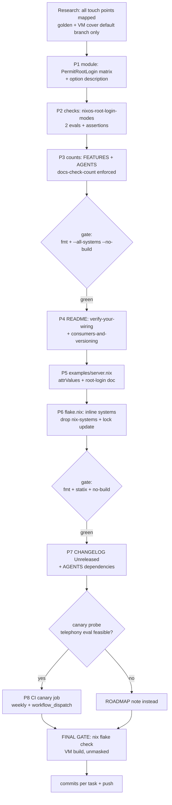

# SUPERB Plan: Root-Login Emission Hardening + Consumer DX (Nix-Native)

**Date**: 2026-09-17 18:48 CEST
**Driver**: 2026-09-17 consumer review (`docs/status/2026-09-17_14-25_nix-ssh-config-consumer-review.md`).
Field data: 3 consumers, 5 hosts, all keys-only; two consumers wrote identical
comments explaining the same `PermitRootLogin "yes"` subtlety — consumer
comments are unsolicited API feedback.
**Guardrail**: No Verschlimmbesserung. The default profile (`allowRootLogin =
false` → `"no"`, golden snapshot, VM default-node assertions) must stay
byte-identical. Only the `allowRootLogin = true` branch changes emission.

## Pareto Breakdown

### 1% that delivers 51%

1. **PermitRootLogin emission matrix** — emit `"prohibit-password"` when
   `allowRootLogin && !passwordAuthentication` (runtime-identical to `"yes"`
   under keys-only, but self-defending if passwords ever flip on downstream);
   `"yes"` only when passwords are explicitly on. Deletes the comment debt both
   production consumers carry; closes an untested branch (zero coverage today —
   the branch every production consumer uses!).

### 4% that delivers 64%

2. = 1% **plus** root-login check family (`nixos-root-login-modes`: both new
   emission states, kill-switch-capable) — the flagship change becomes
   _verified_, not just shipped.

### 20% that delivers 80%

3. = 4% **plus** README "Verify your wiring" section (canonical eval
   one-liners: server settings JSON, HM rendered config, the 0444
   authorized_keys copy check, the vacuous-without-`enable` trap) and
   "Consumers & versioning" (pin policy, canonical follows block, the
   `builtins.attrValues sshKeys` pattern, v2.0-rename heads-up for floaters).

### The other 20% (to 100%)

4. `nix-systems` input removed — literal 3-system list in `flake.nix` (more
   nix-native, one less input consumers must follow).
5. `examples/server.nix` mirrors the real-world `attrValues sshKeys` pattern +
   documents the root-login matrix.
6. Consumer-compat canary CI job (eval telephony's public configs against
   local master via `--override-input`) — only if the feasibility probe
   succeeds.
7. Bookkeeping: CHANGELOG `[Unreleased]`, AGENTS.md (dependencies, check
   counts, systems note), FEATURES.md counts (docs-check-count enforced).
8. Full gate run unmasked (fmt, statix, `--all-systems --no-build`, native
   `nix flake check` incl. VM build) + per-task commits + push.

## Execution Graph

## Comprehensive Plan (30–100 min tasks)

| #   | Task                                                                                                     | Impact   | Effort | Value                                                           |
| --- | -------------------------------------------------------------------------------------------------------- | -------- | ------ | --------------------------------------------------------------- |
| 1   | Module: PermitRootLogin emission matrix + `allowRootLogin` description                                   | Critical | 30 min | Defense-in-depth for every consumer; deletes field comment debt |
| 2   | Checks: `nixos-root-login-modes` family (prohibit-password / yes) + count bookkeeping (FEATURES, AGENTS) | Critical | 45 min | Untested-but-production branch becomes kill-switch guarded      |
| 3   | README: "Verify your wiring" + "Consumers & versioning" + prose sweep for old "yes" claim                | High     | 60 min | Consumers stop inventing eval incantations; pin policy defined  |
| 4   | flake.nix: inline systems list, drop `nix-systems` input, lock update, AGENTS deps                       | Medium   | 30 min | Nix-native, smaller input tax per consumer                      |
| 5   | examples/server.nix: `attrValues sshKeys` field pattern + root-login matrix note                         | Medium   | 30 min | Examples mirror reality                                         |
| 6   | CHANGELOG `[Unreleased]` entries for all of the above                                                    | Medium   | 30 min | Consumer-impact trail                                           |
| 7   | CI canary: weekly + manual job evaling telephony against local master (if probe green)                   | High     | 90 min | Breaking changes caught before release                          |
| 8   | Full unmasked gates + per-task commits + push                                                            | Critical | 60 min | Proven green, clean history                                     |

## Micro-Breakdown (max 12 min each)

| #   | Micro-task                                                                   | Parent |
| --- | ---------------------------------------------------------------------------- | ------ |
| 1.1 | Edit emission ternary in `modules/nixos/ssh.nix`                             | 1      |
| 1.2 | Rewrite `allowRootLogin` option description (matrix + rationale)             | 1      |
| 1.3 | Read diff; confirm default branch byte-identical (`"no"` path)               | 1      |
| 2.1 | Add `nixosRootLoginKeysEval` fixture (allowRootLogin, keys-only)             | 2      |
| 2.2 | Add `nixosRootLoginPasswordsEval` fixture (allowRootLogin + passwords)       | 2      |
| 2.3 | Add `nixos-root-login-modes` assertEq family (2 assertions)                  | 2      |
| 2.4 | Update FEATURES.md count line (20→21 / 21→22)                                | 2      |
| 2.5 | Update AGENTS.md checks row + "20 eval/content checks" mention               | 2      |
| 2.6 | Gate: `nix fmt -- --fail-on-change`                                          | 2      |
| 2.7 | Gate: `nix flake check --all-systems --no-build` (unmasked)                  | 2      |
| 3.1 | README: verify-your-wiring section (server/HM/0444 one-liners + enable trap) | 3      |
| 3.2 | README: consumers-and-versioning section (pins, follows block, v2.0 note)    | 3      |
| 3.3 | README: grep sweep for stale root-login/"yes" prose                          | 3      |
| 3.4 | Gate: fmt + docs-check-count/option-inventory via `--all-systems --no-build` | 3      |
| 4.1 | flake.nix: `systems = [ literal ]`, remove input line                        | 4      |
| 4.2 | `nix flake lock` / verify node pruned via `git diff flake.lock`              | 4      |
| 4.3 | AGENTS.md: dependencies row + supported-systems explanation                  | 4      |
| 4.4 | Gate: fmt + statix + `--all-systems --no-build`                              | 4      |
| 5.1 | examples/server.nix: attrValues pattern + root-login matrix comment          | 5      |
| 5.2 | Gate: examples-evaluate via `--all-systems --no-build`                       | 5      |
| 6.1 | CHANGELOG: Changed (emission), Added (checks/canary), Docs sections          | 6      |
| 7.1 | Verify canary probe result (telephony public + override works)               | 7      |
| 7.2 | Add `consumer-compat` job to check.yml (weekly + dispatch)                   | 7      |
| 7.3 | Wire into checks-summary aggregation                                         | 7      |
| 7.4 | If private/infeasible: ROADMAP entry instead                                 | 7      |
| 8.1 | `nix fmt -- --fail-on-change` (unmasked, bare)                               | 8      |
| 8.2 | `statix check`                                                               | 8      |
| 8.3 | `nix flake check --all-systems --no-build`                                   | 8      |
| 8.4 | `nix flake check` (builds VM; background, exit code captured bare)           | 8      |
| 8.5 | Per-task commits (re-check `git status --short` before each `git add`)       | 8      |
| 8.6 | `git push` (explicitly requested)                                            | 8      |

## Out of Scope (deliberate — Verschlimmbesserung guard)

- No flake-parts removal (the "nix native" ceiling is the systems literal +
  input reduction; a bare-flake rewrite risks the whole check architecture).
- No `sshKeys.all` convenience (mixes attrset-of-strings with a list type —
  `builtins.attrValues` is the idiomatic answer, now documented).
- No golden/VM changes: both cover the default profile, which is unchanged.
- No consumer-repo edits in this pass (separately approved work).
- No release tag (`[Unreleased]` only; `scripts/release.sh` cuts v0.1.5 when
  the owner says so).
