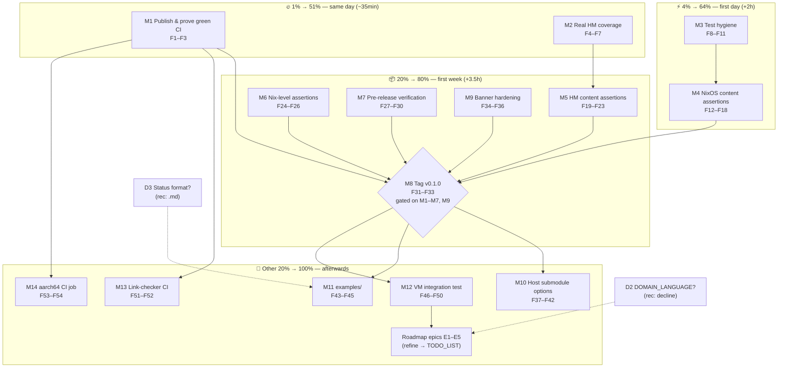

# Pareto Execution Plan — nix-ssh-config

**Date:** 2026-08-22 04:49 CEST
**Status:** ~~Execution plan.~~ **EXECUTED 2026-08-22 — all 14 M-tasks and all 56 fine tasks
completed and verified** (one release-blocking runtime bug found by the restored VM test and
fixed; shipped as v0.1.0 + v0.1.1). Evidence: `docs/status/archived/2026-08-22_06-24_execution-plan-complete-vm-bugfix-release.md`.
Open follow-ups live in `TODO_LIST.md` / `ROADMAP.md`.
**Inputs:** `TODO_LIST.md` (18 open + 2 blocked), `ROADMAP.md` themes, session 7 status report (`docs/status/2026-08-22_04-45_docs-health-audit-and-ci-fix.md` section f)
**Customer:** downstream NixOS / Home Manager consumers of this flake (primary: the maintainer's own machines)
**Method:** Pareto planning skill — 1% → 51%, 4% → 64%, 20% → 80%, then the remaining 20% → 100%

---

## Step 1 — Pareto Breakdown

### The 1% that delivers 51% (~35min, 2 tasks)

**Trust and truth.** The repo currently _looks_ abandoned: 9/9 CI runs red since inception,
and the client module's only test is vacuous. Fixing those two things changes every
consumer's first impression and halves the untested surface:

| ID | What                           | Why it is 51%                                                                                                                                                                                    | Effort |
| -- | ------------------------------ | ------------------------------------------------------------------------------------------------------------------------------------------------------------------------------------------------ | ------ |
| M1 | **Publish & prove green CI**   | Push the staged CI fix; watch the first-ever green `Check` run. Red CI = "broken project" signal to every visitor; green = trustworthy.                                                          | 30min  |
| M2 | **Real Home Manager coverage** | `checks.home-manager-module-evaluates` deepSeq's an empty `matchBlocks`. Point it at `programs.ssh.settings` + assert the `*` block content — the client module goes from 0% to actually tested. | 30min  |

### The 4% that delivers 64% (adds ~2h, 2 tasks)

**Verified security defaults.** The whole selling point is "hardened by default" — right now
only 2 of the hardening claims are asserted, and a real personal key sits in test code:

| ID | What                         | Why the next 13%                                                                                                                                                                             | Effort |
| -- | ---------------------------- | -------------------------------------------------------------------------------------------------------------------------------------------------------------------------------------------- | ------ |
| M3 | **Test hygiene**             | Throwaway test key (no personal keys in test code), remove the `pkgs` lint warning, render-check the archived reports.                                                                       | 30min  |
| M4 | **NixOS content assertions** | Assert what we advertise: crypto lists, custom port, authorizedKeys file, banner, `extraSettings` override, disabled-state no-op. Restores 6 of the 10 dropped checks for the server module. | 100min |

### The 20% that delivers 80% (adds ~3.5h, 5 tasks)

**Releasability.** With both modules honestly tested and docs verified against upstream,
the project can ship its first version:

| ID | What                                  | Why the next 16%                                                                                                                    | Effort |
| -- | ------------------------------------- | ----------------------------------------------------------------------------------------------------------------------------------- | ------ |
| M5 | **HM content assertions**             | Host blocks, user inheritance, identityFile, extraOptions, github.com preset — client-side content finally verified.                | 60min  |
| M6 | **Nix-level assertions**              | Replace fragile JSON-grep with attribute equality — tests stop breaking on formatting.                                              | 30min  |
| M7 | **Pre-release verification**          | OpenSSH compatibility matrix checked against upstream release notes (most-quotable README claim); nixpkgs pinning strategy decided. | 30min  |
| M9 | **Banner hardening**                  | Control-character validation (prevents sshd breakage) + extract the 15-line default to a constant.                                  | 45min  |
| M8 | **Tag v0.1.0** _(gated on M1–M7, M9)_ | First versioned release — consumers can finally pin. CHANGELOG cut + annotated tag.                                                 | 30min  |

### The other 20% → 100% (~5h + roadmap epics)

Depth, convenience, and reach:

| ID    | What                                             | Value                                                                                                     | Effort |
| ----- | ------------------------------------------------ | --------------------------------------------------------------------------------------------------------- | ------ |
| M10   | Host submodule options ×5                        | `proxyJump`, `forwardX11`, local/remote/dynamic forwards — the most common SSH client needs beyond basics | 60min  |
| M11   | `examples/` directory                            | Ready-to-use client + server + combined configs — lowers adoption barrier                                 | 30min  |
| M12   | VM integration test restore                      | QEMU boot, sshd starts, `sshd -T` runtime validation, key auth — gold standard                            | 100min |
| M13   | Markdown link-checker in CI                      | Docs links rot silently today                                                                             | 30min  |
| M14   | aarch64-linux native CI job                      | Native check coverage for arm64 (runner availability permitting)                                          | 30min  |
| E1–E5 | Roadmap epics (stay in ROADMAP.md until refined) | darwinModules · age/sops-nix · OpenSSH overlay pin · multi-node client↔server test · ML-DSA watch         | —      |

**Decisions (BLOCKED, need maintainer — 5min each):**

| ID | Question                          | Recommendation                                                                                                                                                                                                                         |
| -- | --------------------------------- | -------------------------------------------------------------------------------------------------------------------------------------------------------------------------------------------------------------------------------------- |
| D2 | Create `docs/DOMAIN_LANGUAGE.md`? | **Decline** — every domain term is defined exactly once in README's crypto rationale; a glossary duplicates (single-home rule). **Resolved: declined** (recorded in `TODO_LIST.md` Resolved decisions; `CONTRIBUTING.md` Conventions). |
| D3 | Canonical status-report format?   | **`.md`** — user has twice explicitly overridden the skill's HTML default. **Resolved: Markdown** (recorded in `TODO_LIST.md` Resolved decisions; `CONTRIBUTING.md` Conventions).                                                      |

**Deliberately NOT repo TODOs** (tracked in session 7 report, they concern global tooling, not this repo): generalize docs-health annotation tooling for `## A.`-style sections (upstream skill PR, 1h); make "CI red" a standing docs-health VERIFY input (process change).

---

## Step 2 — Comprehensive Plan (30–100min tasks, sorted by importance/impact/effort/customer-value)

| #  | ID  | Task (bundle)                                                                 | Covers TODO(s)   | Pareto tier | Impact | Effort  | Customer value                                      |
| -- | --- | ----------------------------------------------------------------------------- | ---------------- | ----------- | ------ | ------- | --------------------------------------------------- |
| 1  | M1  | Publish & prove: push branch, watch first CI run, record result               | T4               | 1%          | High   | 30min   | Trust signal — repo stops looking broken            |
| 2  | M2  | Real HM coverage: fix deepSeq target + `*` block content assertions           | T1               | 1%          | High   | 30min   | Client module actually tested                       |
| 3  | M3  | Test hygiene: throwaway key, remove `pkgs` binding, render-check reports      | T5, T14, T13     | 4%          | Med    | 30min   | No personal keys in test code; clean lint           |
| 4  | M4  | NixOS content assertions: crypto, port, keys, banner, extraSettings, disabled | T2 (server half) | 4%          | High   | 100min  | "Hardened by default" becomes verified, not claimed |
| 5  | M5  | HM content assertions: hosts, inheritance, identityFile, extraOptions, github | T2 (client half) | 20%         | High   | 60min   | Generated client config verified                    |
| 6  | M6  | Nix-level assertions replacing JSON-grep                                      | T6               | 20%         | Med    | 30min   | Tests robust to formatting drift                    |
| 7  | M7  | Pre-release verification: OpenSSH matrix vs upstream + nixpkgs pin decision   | T12, T21         | 20%         | Med    | 30min   | README's most-quotable claim becomes true           |
| 8  | M9  | Banner hardening: control-char validation + extract constant                  | T9, T11          | 20%         | Med    | 45min   | Prevents sshd breakage via banner                   |
| 9  | M8  | Release v0.1.0: CHANGELOG cut + annotated tag **(gated on M1–M7, M9)**        | T3               | 20%         | High   | 30min   | Consumers can pin a version                         |
| 10 | M10 | Host submodule options: proxyJump, forwardX11, 3× forwards + tests + docs     | T8               | other 20%   | Med    | 60min   | Covers the most common advanced SSH needs           |
| 11 | M11 | `examples/` directory: client, server, combined, README                       | T10              | other 20%   | Low    | 30min   | Adoption barrier drops                              |
| 12 | M12 | VM integration test restore (QEMU, sshd -T, key auth)                         | T7               | other 20%   | Med    | 100min  | Runtime proof, not just eval proof                  |
| 13 | M13 | CI: markdown link-checker step                                                | T16              | other 20%   | Low    | 30min   | Docs stop rotting silently                          |
| 14 | M14 | CI: aarch64-linux native job (runner permitting)                              | T17              | other 20%   | Low    | 30min   | arm64 natively checked                              |
| 15 | D2  | Decision: `docs/DOMAIN_LANGUAGE.md`?                                          | —                | gate        | Low    | 5min    | Closes open question g/3                            |
| 16 | D3  | Decision: canonical status-report format                                      | —                | gate        | Low    | 5min    | Ends format flip-flopping                           |
| 17 | E1  | Epic: `darwinModules` output (macOS sshd)                                     | ROADMAP          | backlog     | Low    | ~60min  | Cross-platform server (refine before TODO)          |
| 18 | E2  | Epic: age/sops-nix secret integration                                         | ROADMAP          | backlog     | Low    | ~2h     | Private key distribution (needs design decision)    |
| 19 | E3  | Epic: flake overlay pinning OpenSSH                                           | ROADMAP          | backlog     | Low    | ~30min  | Pinned OpenSSH version                              |
| 20 | E4  | Epic: multi-node client↔server NixOS test                                     | ROADMAP          | backlog     | Low    | ~2h     | End-to-end handshake proof                          |
| 21 | E5  | Epic: ML-DSA signature watch                                                  | ROADMAP          | backlog     | —      | passive | Post-quantum auth when OpenSSH ships it             |

**Sort rationale:** trust (M1) before truth (M2) before verified security (M4) before release (M8); convenience and depth follow the release because they are additive, not blocking. D-gates close questions whenever the maintainer answers; they cost 5min and unblock nothing else, so they float.

---

## Step 3 — Fine Breakdown (≤12min per task, sorted within tiers by impact/effort)

### Tier 1% → 51%

| #  | Fine task                                                                | Parent | Effort | Verify by                                     |
| -- | ------------------------------------------------------------------------ | ------ | ------ | --------------------------------------------- |
| F1 | Push master to origin                                                    | M1     | 2min   | `git status` clean, remote updated            |
| F2 | Watch the `Check` run to completion (`gh run watch`)                     | M1     | 10min  | run conclusion = success                      |
| F3 | Record result; update TODO_LIST/CHANGELOG if green                       | M1     | 10min  | TODO row removed, CHANGELOG entry             |
| F4 | Fix HM check: deepSeq `programs.ssh.settings`, not `matchBlocks`         | M2     | 5min   | `nix flake check` passes                      |
| F5 | Assert `*` block content (KexAlgorithms/Ciphers/MACs strings, agent off) | M2     | 10min  | new check passes; flip a value to see it fail |
| F6 | Assert `github.com` block (User git, ControlMaster auto)                 | M2     | 5min   | new check passes                              |
| F7 | Full local gate: eval-all + native + fmt                                 | M2     | 5min   | all three green                               |

### Tier 4% → 64%

| #   | Fine task                                                                               | Parent | Effort | Verify by                                     |
| --- | --------------------------------------------------------------------------------------- | ------ | ------ | --------------------------------------------- |
| F8  | Generate throwaway ed25519 key; replace `testKey` in flake.nix                          | M3     | 10min  | no personal key in `flake.nix:51`; gate green |
| F9  | Remove unused `pkgs` binding (`modules/nixos/ssh.nix:4`)                                | M3     | 2min   | nil diagnostics clean                         |
| F10 | Render-check archived reports in a viewer; fix any strikethrough breakage               | M3     | 10min  | tables render as intended                     |
| F11 | Re-verify LSP diagnostics for whole project                                             | M3     | 3min   | 0 warnings                                    |
| F12 | NixOS check: custom port → `services.openssh.ports`                                     | M4     | 10min  | check passes                                  |
| F13 | NixOS check: authorizedKeys → `/etc/ssh/authorized_keys` text                           | M4     | 10min  | check passes                                  |
| F14 | NixOS check: banner text + `Banner` path                                                | M4     | 10min  | check passes                                  |
| F15 | NixOS check: crypto lists (Ciphers/Macs/Kex) + string variants (HostKey/PubkeyAccepted) | M4     | 12min  | check passes; matches crypto.nix              |
| F16 | NixOS check: `extraSettings` overrides a default (e.g. LoginGraceTime)                  | M4     | 10min  | check passes                                  |
| F17 | NixOS check: disabled-state sets no openssh config                                      | M4     | 10min  | check passes                                  |
| F18 | Full local gate                                                                         | M4     | 10min  | all green                                     |

### Tier 20% → 80%

| #   | Fine task                                                              | Parent | Effort | Verify by                          |
| --- | ---------------------------------------------------------------------- | ------ | ------ | ---------------------------------- |
| F19 | HM check: host block HostName/User rendered                            | M5     | 10min  | check passes                       |
| F20 | HM check: user inheritance (null → `ssh-config.user`)                  | M5     | 8min   | check passes                       |
| F21 | HM check: per-host identityFile + port                                 | M5     | 10min  | check passes                       |
| F22 | HM check: extraOptions merged into host block                          | M5     | 10min  | check passes                       |
| F23 | Full local gate                                                        | M5     | 10min  | all green                          |
| F24 | Rewrite `assertContains` as attribute-equality helper                  | M6     | 12min  | existing checks still pass         |
| F25 | Port the 2 existing JSON-grep checks to the new helper                 | M6     | 10min  | identical assertions, Nix-native   |
| F26 | Full local gate                                                        | M6     | 5min   | all green                          |
| F27 | Verify ML-KEM ≥ 9.9 + default since 10.0 against OpenSSH release notes | M7     | 12min  | sources cited in README            |
| F28 | Verify sntrup761 ≥ 8.5, curve25519/chacha20 ≥ 6.5                      | M7     | 10min  | sources cited                      |
| F29 | Correct README matrix if any version is wrong                          | M7     | 8min   | matrix matches upstream            |
| F30 | Decide + document nixpkgs pinning strategy                             | M7     | 10min  | decision recorded in README/AGENTS |
| F31 | Final CHANGELOG polish for 0.1.0                                       | M8     | 10min  | entries match reality              |
| F32 | Create annotated `v0.1.0` tag, push it                                 | M8     | 5min   | tag visible on GitHub              |
| F33 | Verify tag/release renders correctly                                   | M8     | 5min   | release page checked               |
| F34 | Add control-character validation to `bannerText`                       | M9     | 10min  | rejection test passes              |
| F35 | Extract banner default to shared constant                              | M9     | 8min   | module slimmer, behavior identical |
| F36 | Banner tests + full gate                                               | M9     | 10min  | all green                          |

### Other 20% → 100%

| #   | Fine task                                                    | Parent | Effort | Verify by                |
| --- | ------------------------------------------------------------ | ------ | ------ | ------------------------ |
| F37 | `proxyJump` option + test                                    | M10    | 8min   | check passes             |
| F38 | `forwardX11` option + test                                   | M10    | 8min   | check passes             |
| F39 | `localForwards` option + test                                | M10    | 12min  | check passes             |
| F40 | `remoteForwards` option + test                               | M10    | 12min  | check passes             |
| F41 | `dynamicForwards` option + test                              | M10    | 12min  | check passes             |
| F42 | Update README host-options table                             | M10    | 12min  | table matches module     |
| F43 | `examples/client.nix`                                        | M11    | 10min  | evals in a scratch flake |
| F44 | `examples/server.nix`                                        | M11    | 10min  | evals in a scratch flake |
| F45 | `examples/README.md`                                         | M11    | 10min  | links resolve            |
| F46 | VM test skeleton via `testers.nixosTest` (x86_64-linux only) | M12    | 12min  | skeleton evals           |
| F47 | VM test: sshd starts, banner served                          | M12    | 12min  | test passes in QEMU      |
| F48 | VM test: `sshd -T` crypto assertions                         | M12    | 12min  | test passes              |
| F49 | VM test: key auth succeeds                                   | M12    | 12min  | test passes              |
| F50 | Wire into `checks.x86_64-linux` + full gate                  | M12    | 12min  | `nix flake check` green  |
| F51 | Add link-checker step to CI                                  | M13    | 12min  | CI run green             |
| F52 | Fix any broken links found                                   | M13    | 10min  | checker clean            |
| F53 | Add aarch64-linux job to workflow                            | M14    | 10min  | workflow valid           |
| F54 | Verify aarch64 run green                                     | M14    | 10min  | run conclusion = success |

### Decision gates (BLOCKED on maintainer)

| #   | Fine task                                                | Parent | Effort | Unblock condition      |
| --- | -------------------------------------------------------- | ------ | ------ | ---------------------- |
| F55 | Answer: create `docs/DOMAIN_LANGUAGE.md`? (rec: decline) | D2     | 5min   | maintainer answers g/3 |
| F56 | Answer: canonical status-report format? (rec: `.md`)     | D3     | 5min   | maintainer decides     |

**Totals:** 14 medium tasks (≈ 9.5h) · 56 fine tasks · 2 decision gates · 5 roadmap epics parked.

---

## Execution Graph

**Reading the graph:** M1 and M2 are independent — run them in parallel. M3 unblocks M4 conceptually (hygiene before new assertions). The v0.1.0 gate closes only when every verification task above it is green. Everything in T4 is post-release additive work with no reverse dependencies.

---

## Sequencing rules (anti-Verschlimmerung)

1. **Never skip the gate.** After every fine task touching `flake.nix` or `modules/`: `nix flake check --all-systems --no-build` && `nix flake check` && `nix fmt -- --fail-on-change`. A plan that breaks the build is worse than no plan.
2. **One M-task per commit**, message lists its F-tasks with evidence.
3. **Kill-switch tests:** every new assertion must be proven to fail on a deliberately wrong value once (F5 note) — a test that cannot fail is decoration.
4. **M8 does not start** until M1–M7 and M9 are green; tagging an unverified state ships a lie.
5. **Epics stay in ROADMAP.md** until refined into bounded tasks — do not let backlog blur into the actionable list.
6. **No scope creep:** VM test (M12) restores what existed pre-`e910e78`; it does not grow multi-node features (that is E4).

## Verification checklist (whole plan)

- [x] CI `Check` green on GitHub (first time ever) — first green run 2026-08-22; latest green: run `32552000904`
- [x] Both modules have content assertions, not just eval checks (`9f64c93`, `8be838b`, `e1c3de3`)
- [x] No personal keys (`c35a482`), no lint warnings, README claims upstream-verified (`bc62979`)
- [x] `v0.1.0` tag exists (`99d533b`), CHANGELOG cut matches reality (+ v0.1.1 `83ecd85`)
- [x] Every removed TODO has a CHANGELOG entry (no trophy-section rot)

---

_Generated by Crush (GLM-5.3) — Pareto planning session, 2026-08-22._
