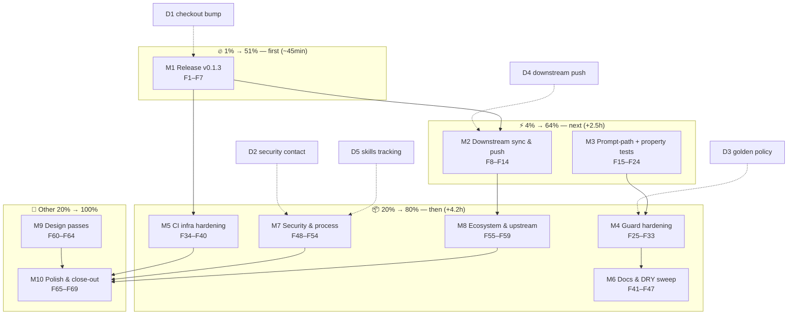

# Pareto Execution Plan 3 — nix-ssh-config (v0.1.3 & Depth)

**EXECUTED 2026-08-29** — all 10 M-tasks, 74 fine tasks and 5 decision
gates done; evidence in
`docs/status/2026-08-29_18-10_plan-3-execution-complete.md`.

**Date:** 2026-08-29 16:18 CEST
**Inputs:** `TODO_LIST.md` (4 open rows), `ROADMAP.md` themes 1–6 with
refined/parked epics, the plan-2 execution status report
(`docs/status/2026-08-29_16-12_plan-2-execution-complete.md`, a–g), and
live repo state: `master` at `e70b8fd`, all CI jobs green, one open
Dependabot PR (actions/checkout 4.4.0 → 7.0.1), v0.1.2 Latest, and the
entire plan-2 output sitting unreleased in `[Unreleased]`.
**Customer:** downstream NixOS / Home Manager consumers (primary:
`nix-internatial-telephony`, pinned to `v0.1.2`), plus every future
contributor touched by the new meta files.
**Method:** Pareto planning — 1% → 51%, 4% → 64%, 20% → 80%, remaining
20% → 100%.
**Baseline:** `master` at `e70b8fd`, tree clean after this plan commits,
final plan-2 CI run `33256614831` green on all three jobs.

---

## Step 1 — Pareto Breakdown

### The 1% that delivers 51% (~45min, 1 task)

**Ship v0.1.3.** Everything plan 2 built — VM runtime proofs, docs-drift
guards, the extracted `tests/checks.nix`, CI hardening, the client
runtime proof, the golden snapshot, seven new options, prettier-enforced
docs, repo meta — is sitting in `CHANGELOG.md` `[Unreleased]`. No
consumer can pin any of it, the `v0.1.2` tag is still the newest thing
the world can fetch, and the release-script flow is proven but unused on
a real version. One release motion converts the entire session's work
from "on master" to "consumable and protected by tags".

| ID  | What                                                                                                                                       | Why it is 51%                                                                                                                                           | Effort |
| --- | ------------------------------------------------------------------------------------------------------------------------------------------ | ------------------------------------------------------------------------------------------------------------------------------------------------------- | ------ |
| M1  | **Release v0.1.3 end-to-end** (decision on the checkout bump, date CHANGELOG, dry-run, tag, push, Release object, Latest, CI verification) | Makes every plan-2 feature consumable and immutable; exercises `scripts/release.sh` for real; the Dependabot major-bump decision is resolved on the way | 45min  |

### The 4% that delivers 64% (adds ~1.5h, 2 tasks)

**Close the loop downstream, then close the last proof gaps.** The
downstream stack still pins v0.1.2 while v0.1.3 supersedes it — pin, push,
and watch their CI. And of the security claims, exactly one remains
unproven at runtime: that a _real_ keyboard-interactive prompt exchange
is refused — not just that the method list is short. Port-bound property
tests are the cheapest mechanical coverage win left.

| ID  | What                                                                                                                                    | Why the next 13%                                                                                                                                                  | Effort |
| --- | --------------------------------------------------------------------------------------------------------------------------------------- | ----------------------------------------------------------------------------------------------------------------------------------------------------------------- | ------ |
| M2  | **Downstream sync & push** (pin nix-internatial-telephony to v0.1.3, run their gates, commit explicit-paths-only, push, watch their CI) | Retires the workaround story completely; their two SSH VM suites become the first external validation of the new pin discipline                                   | 55min  |
| M3  | **Test depth: prompt-path positive test + port property tests**                                                                         | The prompt-path test is the last headline security claim proven only by method-list assertion; property tests close the input-validation gap on every port option | 100min |

### The 20% that delivers 80% (adds ~4.5h, 5 tasks)

**Harden the machinery that now does the guarding.** Plan 2 made docs,
counts, and runtime behavior self-enforcing; the guards themselves still
have soft spots (hardcoded `-2/-1` in the count check, the unexplained
`treefmt`/`format` dual attr, a manual golden-regen dance). CI still
swallows VM transcripts on failure and has no drift-catching schedule.
Docs drift is guarded mechanically but a few human-facing pages lag the
new options. And the security/process promises (SECURITY contact, lint
mirrors, release-script verification) need to become real.

| ID  | What                                                                                                                                                                                                             | Why the next 16%                                                                                                                 | Effort |
| --- | ---------------------------------------------------------------------------------------------------------------------------------------------------------------------------------------------------------------- | -------------------------------------------------------------------------------------------------------------------------------- | ------ |
| M4  | **Guard hardening** (derive contentCheckCount formatter names, root-cause `treefmt`/`format` dual attr, `scripts/regen-golden.sh`, examples coverage in the docs guard)                                          | The guards must not depend on magic numbers or manual incantations                                                               | 60min  |
| M5  | **CI infra hardening** (VM transcript artifacts on failure, scheduled full-gate cron, ubuntu pin, lychee token, branch-protection checklist)                                                                     | A red CI run without a readable VM transcript repeats today's debugging pain; cron catches nixpkgs drift between weekly lock PRs | 60min  |
| M6  | **Docs & DRY sweep** (README snippets for the new options, pre-push hook + golden-regen docs, stale-claims grep sweep, VM testScript shared ssh-options variable)                                                | New options nobody can find in the README are half-shipped; the testScript has five copies of the same option string             | 45min  |
| M7  | **Security & process** (SECURITY.md contact per D2, strikethrough lint as a shared local+CI script, release.sh link verification + CI dry-run test, RELEASE_NOTES template, skills-dir tracking decision per D5) | Turns policy promises into mechanical, verifiable steps                                                                          | 50min  |
| M8  | **Ecosystem & upstream** (HM knownHosts upstream request prep with verify-before-filing, matrix re-verification procedure with concrete steps, ML-DSA watch checklist, PerSourcePenalties flakiness note)        | The recurring watches due 2026-12-01 need procedures, not intentions                                                             | 40min  |

### The other 20% → 100% (adds ~3h + gates)

| ID  | What                                                                                                                                                  | Value                                                         | Effort |
| --- | ----------------------------------------------------------------------------------------------------------------------------------------------------- | ------------------------------------------------------------- | ------ |
| M9  | **Design passes** (HM-in-NixOS-VM design doc, host `match` blocks design, age/sops guide outline v1, hermetic-dprint revisit note)                    | Turns the four remaining ROADMAP ideas into buildable designs | 55min  |
| M10 | **Polish & close-out** (summary-job badge, devShell PATH for scripts/, auto-merge note, plan-3 execution status report, final push + CI verification) | Leaves the repo tidy, discoverable, and verified              | 45min  |

**Decisions (5min each, with recommendations):**

| ID  | Question                                                                                                         | Recommendation                                                                                                                      |
| --- | ---------------------------------------------------------------------------------------------------------------- | ----------------------------------------------------------------------------------------------------------------------------------- |
| D1  | Merge Dependabot's actions/checkout 4.4.0 → 7.0.1 (major jump)?                                                  | **Merge** — its CI is green, it removes the Node 20 deprecation warnings seen in today's runs, and Dependabot's job is exactly this |
| D2  | What contact goes into SECURITY.md?                                                                              | **GitHub private vulnerability reporting first**, maintainer email second (needs the address from the maintainer)                   |
| D3  | Golden policy: byte-stable manual regen vs auto-regen label?                                                     | **Byte-stable manual**, but with `scripts/regen-golden.sh` (M4) so "manual" is one command                                          |
| D4  | Push nix-internatial-telephony now (their CI runs on push; the mixed `bcf9271` carries the disk/Terraform work)? | **Push after M1**, split concerns only if the maintainer prefers — their pre-commit hooks already passed                            |
| D5  | Track `~/.config/crush/skills` (docs-health tooling) in a repo?                                                  | **Yes** — plan 2's F78 fix is untracked; a dotfiles repo prevents silent tooling drift                                              |

---

## Step 2 — Comprehensive Plan (30–100min tasks, sorted by importance/impact/effort/customer-value)

| #   | ID  | Task (bundle)                                                                                                | Covers                     | Pareto tier | Impact | Effort | Customer value                                            |
| --- | --- | ------------------------------------------------------------------------------------------------------------ | -------------------------- | ----------- | ------ | ------ | --------------------------------------------------------- |
| 1   | M1  | Release v0.1.3: D1 checkout decision, date CHANGELOG, dry-run, tag/push/Release, Latest, CI verify           | plan-2 [Unreleased] output | 1%          | High   | 45min  | All new features consumable and immutable                 |
| 2   | M2  | Downstream sync & push: pin v0.1.3, their gates, explicit-path commit, push, watch CI                        | nix-internatial-telephony  | 4%          | High   | 55min  | External validation of the pin + workaround retirement    |
| 3   | M3  | Test depth: positive prompt-path VM test + port property tests (both kill-switched)                          | TODO_LIST Test depth rows  | 4%          | High   | 100min | The last unproven security claim becomes runtime-proven   |
| 4   | M4  | Guard hardening: derived count names, dual-attr root cause, regen-golden script, examples guard              | flake guards               | 20%         | Med    | 60min  | Guards stop depending on magic numbers/manual steps       |
| 5   | M5  | CI infra: failure artifacts, scheduled gate, ubuntu pin, lychee token, protection checklist                  | CI workflows               | 20%         | Med    | 60min  | Red runs stay debuggable; drift gets caught on schedule   |
| 6   | M6  | Docs & DRY: README snippets, hook/golden docs, stale sweep, testScript DRY                                   | README/CONTRIBUTING/tests  | 20%         | Med    | 45min  | New options discoverable; one place to change ssh options |
| 7   | M7  | Security & process: D2 contact, shared lint script, release.sh verification, RELEASE_NOTES template, D5 note | SECURITY.md/scripts        | 20%         | Med    | 50min  | Disclosure path real; release mechanics verified in CI    |
| 8   | M8  | Ecosystem & upstream: knownHosts request prep, matrix + ML-DSA watch procedures, penalties note              | ROADMAP watches; upstream  | 20%         | Med    | 40min  | December watches are executable, not aspirational         |
| 9   | M9  | Design passes: HM-in-VM doc, match blocks design, age/sops outline, hermetic dprint note                     | ROADMAP themes 1/2/3       | other 20%   | Low    | 55min  | Next builder starts from a design, not a blank page       |
| 10  | M10 | Polish & close-out: badge, devShell PATH, auto-merge note, execution status report, final push               | repo polish                | other 20%   | Low    | 45min  | Tidy, verified end state                                  |
| 11  | D1  | Decision: checkout 4→7 major bump                                                                            | M1 precondition            | gate        | Med    | 5min   | Unblocks M1; kills Node 20 warnings                       |
| 12  | D2  | Decision: SECURITY.md contact                                                                                | M7                         | gate        | Med    | 5min   | Private disclosure path becomes real                      |
| 13  | D3  | Decision: golden policy                                                                                      | M4                         | gate        | Low    | 5min   | One regeneration policy, one command                      |
| 14  | D4  | Decision: downstream push authorization                                                                      | M2                         | gate        | Med    | 5min   | Their CI validates the pin on our schedule, not someday   |
| 15  | D5  | Decision: track skills dir in a repo                                                                         | M7                         | gate        | Low    | 5min   | Tooling changes stop being untracked                      |

**Sort rationale:** ship (M1) before everything because tags are the only
contract consumers can hold; downstream (M2) immediately after so the pin
chain never points at a superseded release; test depth (M3) before guard
polish (M4) because a runtime proof beats a cleaner guard; guards before
CI polish (M5/M6/M7) because correctness tooling precedes convenience;
designs (M9) and polish (M10) last. D1 gates M1, D2 gates M7, D3 gates
M4, D4 gates M2, D5 floats inside M7.

---

## Step 3 — Fine Breakdown (≤12min per task, sorted within tiers)

### Tier 1% → 51%

| #   | Fine task                                                                                                                                              | Parent | Effort | Verify by                                                      |
| --- | ------------------------------------------------------------------------------------------------------------------------------------------------------ | ------ | ------ | -------------------------------------------------------------- |
| F1  | Execute D1: review the checkout 4→7 PR diff, merge (rec) or close with reason; confirm its CI green                                                    | M1     | 10min  | PR merged/closed; decision recorded in the plan commit         |
| F2  | Run the full local gate bare and unpiped: `nix fmt -- --fail-on-change`, `statix check`, `nix flake check --all-systems --no-build`, `nix flake check` | M1     | 10min  | Four exit codes 0, in hand, nothing piped                      |
| F3  | Date `CHANGELOG.md` `[Unreleased]` as `[0.1.3] — <today>`, rewrite compare links, open a fresh `[Unreleased]`                                          | M1     | 8min   | Diff shows dated section + three link rows                     |
| F4  | `DRY_RUN=1 scripts/release.sh 0.1.3` — dry-run must print the tag/push/release plan                                                                    | M1     | 5min   | Dry-run output lists all four planned commands                 |
| F5  | Commit the changelog; execute `scripts/release.sh 0.1.3` (annotated tag, push master + tag)                                                            | M1     | 8min   | `git tag -l` shows v0.1.3; push succeeded                      |
| F6  | `gh release create v0.1.3 --notes-from-tag` + `gh release edit v0.1.3 --latest`                                                                        | M1     | 5min   | Release page renders; `gh release list` shows Latest           |
| F7  | Watch CI on the release commit: all three jobs green                                                                                                   | M1     | 10min  | `gh run view` shows ✓ check, ✓ check-aarch64, ✓ checks-summary |

### Tier 4% → 64%

| #   | Fine task                                                                                                                                   | Parent | Effort | Verify by                                                                         |
| --- | ------------------------------------------------------------------------------------------------------------------------------------------- | ------ | ------ | --------------------------------------------------------------------------------- |
| F8  | Execute D4: get explicit go for the downstream push (or a split instruction)                                                                | M2     | 5min   | Maintainer answer quoted in the M2 commit message                                 |
| F9  | Downstream: bump `nix-ssh-config.url` v0.1.2 → v0.1.3, `nix flake update nix-ssh-config`                                                    | M2     | 8min   | Lock rev equals the v0.1.3 tag commit                                             |
| F10 | Downstream: run eval/statix/format checks green                                                                                             | M2     | 10min  | Three exit codes 0                                                                |
| F11 | Downstream: rebuild `telephony-ssh` VM green against the new pin                                                                            | M2     | 12min  | `nix build --rebuild -L` exit 0                                                   |
| F12 | Downstream: rebuild `telephony-boot` VM green                                                                                               | M2     | 12min  | exit 0                                                                            |
| F13 | Downstream: commit with **explicit paths only** after `git diff --cached` review; push; watch their CI                                      | M2     | 12min  | Commit contains exactly the intended files; their CI ✓                            |
| F14 | Downstream: adjust `docs/upstream.md` wording v0.1.2 → v0.1.3 pin if the section needs it                                                   | M2     | 5min   | grep shows the new tag only in living docs                                        |
| F15 | M3: add the prompt-path VM fixture — second sshd variant node with `kbdInteractiveAuthentication = true`, `usePAM = true`, locked test user | M3     | 12min  | Eval of the check derivation succeeds                                             |
| F16 | M3: drive `ssh` with `PreferredAuthentications=keyboard-interactive` under `sshpass` and a known-wrong password                             | M3     | 12min  | New subtest fails _before_ the assertion is finalized (expected interim red)      |
| F17 | M3: assert refusal end-to-end (exit ≠ 0, no password accepted, auth log shows the prompt path)                                              | M3     | 12min  | Subtest green; transcript shows the exchange                                      |
| F18 | M3: kill-switch — set the test user's password to the probed one → subtest must go red → restore                                            | M3     | 12min  | Observed red with message, then green                                             |
| F19 | M3: property-test helper — eval-failure builder asserting a config option throws                                                            | M3     | 12min  | Helper evaluates; negative case proven red once                                   |
| F20 | M3: port cases — `port = 65536` and `port = -1` rejected for `port` and `listenAddresses` sub-ports                                         | M3     | 12min  | Check green; deliberate accepting-wiring red once                                 |
| F21 | M3: wire both new checks into `contentChecks` on Linux-only systems; keep counts in sync (docs-check-count forces the FEATURES update)      | M3     | 12min  | `nix flake check --all-systems --no-build` red until FEATURES updated, then green |
| F22 | M3: full native gate incl. both VM suites                                                                                                   | M3     | 12min  | exit 0 with `-L` transcript retained                                              |
| F23 | M3: CHANGELOG + FEATURES rows for prompt-path and property tests                                                                            | M3     | 8min   | Diff shows both rows                                                              |
| F24 | M3: commit (one commit, F-tasks listed)                                                                                                     | M3     | 3min   | `git log -1` message lists F15–F23 evidence                                       |

### Tier 20% → 80%

| #   | Fine task                                                                                                                                                      | Parent | Effort | Verify by                                           |
| --- | -------------------------------------------------------------------------------------------------------------------------------------------------------------- | ------ | ------ | --------------------------------------------------- |
| F25 | M4: rewrite `contentCheckCount` to derive formatter names from `attrNames config.checks` (no `-2`)                                                             | M4     | 12min  | Check green; a comment explains the derivation      |
| F26 | M4: root-cause why `treefmt` and `format` both appear in `attrNames checks`; document or dedupe                                                                | M4     | 12min  | Finding recorded in a comment or the attr removed   |
| F27 | M4: kill-switch the count guard (tamper a FEATURES number → red → restore)                                                                                     | M4     | 8min   | Observed red, then green                            |
| F28 | M4: `scripts/regen-golden.sh` — empty the golden, build the VM, extract the GOLDEN block, write back                                                           | M4     | 12min  | Script exists, executable, refuses dirty trees      |
| F29 | M4: run the regen script; `git diff` on the golden must be empty (idempotence)                                                                                 | M4     | 12min  | No diff; compare run green                          |
| F30 | M4: extend `docs-option-inventory` to options documented in `examples/*`                                                                                       | M4     | 12min  | Check green with examples coverage                  |
| F31 | M4: kill-switch examples coverage (remove an example line → red → restore)                                                                                     | M4     | 8min   | Observed red, then green                            |
| F32 | M4: full all-systems eval gate                                                                                                                                 | M4     | 8min   | exit 0                                              |
| F33 | M4: commit                                                                                                                                                     | M4     | 3min   | message lists F25–F32                               |
| F34 | M5: CI step to upload the VM/driver transcript as an artifact when any job fails                                                                               | M5     | 12min  | Workflow YAML valid; artifact condition `failure()` |
| F35 | M5: scheduled full-gate cron (e.g. Sundays, before Monday's lock PR) in a new or existing workflow                                                             | M5     | 8min   | cron line present; workflow_dispatch for testing    |
| F36 | M5: pin the x86_64 `check` job to `ubuntu-24.04`                                                                                                               | M5     | 5min   | Diff shows runs-on change                           |
| F37 | M5: lychee step gets `GITHUB_TOKEN` env to dodge rate limits                                                                                                   | M5     | 8min   | Diff shows env; job green                           |
| F38 | M5: branch-protection checklist in CONTRIBUTING (require `checks-summary`, require branches up to date) — settings themselves are maintainer UI work           | M5     | 8min   | Section exists with exact setting names             |
| F39 | M5: verify CI green with all workflow changes                                                                                                                  | M5     | 12min  | run ✓ all jobs                                      |
| F40 | M5: commit                                                                                                                                                     | M5     | 3min   | message lists F34–F39                               |
| F41 | M6: README snippets — `listenAddresses` + the `usePam`/`authenticationMethods` 2FA recipe                                                                      | M6     | 12min  | Rows render; docs guard green                       |
| F42 | M6: CONTRIBUTING — pre-push hook install note + golden-regen pointer                                                                                           | M6     | 8min   | Section exists, references scripts                  |
| F43 | M6: stale-claims sweep — grep docs for pre-v0.1.2 defaults and old counts; fix what the guards cannot see                                                      | M6     | 12min  | grep finds nothing stale                            |
| F44 | M6: VM testScript DRY — hoist the repeated ssh option string into one Python variable                                                                          | M6     | 8min   | VM green; diff shrinks the script                   |
| F45 | M6: `examples/server.nix` comments for `usePam`/`authenticationMethods` (2FA recipe)                                                                           | M6     | 8min   | examples-evaluate green                             |
| F46 | M6: gate + docs rows where behavior text changed                                                                                                               | M6     | 10min  | gate green                                          |
| F47 | M6: commit                                                                                                                                                     | M6     | 3min   | message lists F41–F46                               |
| F48 | M7: execute D2 — write the chosen contact + disclosure flow into SECURITY.md                                                                                   | M7     | 5min   | SECURITY.md names a real contact                    |
| F49 | M7: extract the strikethrough lint into `scripts/check-strikethrough.sh`; CI step calls it (single source)                                                     | M7     | 12min  | Local run == CI step; lint green                    |
| F50 | M7: release.sh verifies compare links resolve (lychee/curl) in addition to grepping                                                                            | M7     | 8min   | Dry-run output includes the link check              |
| F51 | M7: CI job running `DRY_RUN=1 scripts/release.sh 0.1.3` expecting the "tag exists" refusal (proves the script in CI)                                           | M7     | 12min  | Job green on the expected failure path              |
| F52 | M7: `.github/RELEASE_NOTES_TEMPLATE.md` skeleton                                                                                                               | M7     | 8min   | File present; referenced by release.sh comment      |
| F53 | M7: record the D5 skills-dir decision (create dotfiles repo note or park with reason)                                                                          | M7     | 5min   | Note in ROADMAP theme 6                             |
| F54 | M7: gate + commit                                                                                                                                              | M7     | 8min   | gate green; commit lists F48–F53                    |
| F55 | M8: HM knownHosts upstream request — verify which HM versions have/lack `programs.ssh.knownHosts`; draft issue text; do NOT file without the verification pass | M8     | 12min  | Draft saved; verification table in the draft        |
| F56 | M8: matrix re-verification procedure — exact upstream URLs, diff checklist, owner, date (2026-12-01)                                                           | M8     | 8min   | ROADMAP theme 4 has the procedure                   |
| F57 | M8: ML-DSA watch checklist — what to grep in release notes, what to add when it lands                                                                          | M8     | 8min   | ROADMAP theme 4 updated                             |
| F58 | M8: AGENTS gotcha — PerSourcePenalties 5s deferred-penalty window vs sequential subtests (why the wrong-key test cannot flake)                                 | M8     | 8min   | Gotcha present in AGENTS.md                         |
| F59 | M8: gate + commit                                                                                                                                              | M8     | 8min   | gate green; commit lists F55–F58                    |

### Other 20% → 100%

| #   | Fine task                                                                                                                                          | Parent | Effort | Verify by                                  |
| --- | -------------------------------------------------------------------------------------------------------------------------------------------------- | ------ | ------ | ------------------------------------------ |
| F60 | M9: HM-in-NixOS-VM design doc — `home-manager.users` integration, cost, alternatives                                                               | M9     | 12min  | Doc in `docs/designs/` or ROADMAP link     |
| F61 | M9: host `match` blocks design — option shape, rendering order, `Match` keyword caveats                                                            | M9     | 12min  | Design written                             |
| F62 | M9: age/sops guide outline v1 — scope, identity paths, per-host placement decision tree                                                            | M9     | 12min  | Outline committed                          |
| F63 | M9: hermetic-dprint revisit note — track treefmt-nix vendored-plugin support                                                                       | M9     | 8min   | ROADMAP theme 6 note with tracking pointer |
| F64 | M9: gate + commit                                                                                                                                  | M9     | 8min   | gate green; commit lists F60–F63           |
| F65 | M10: summary-job badge next to the CI badge on README                                                                                              | M10    | 5min   | Badge row renders; docs guard green        |
| F66 | M10: devShell puts `scripts/` on PATH (`shellHook` or `packages` symlink)                                                                          | M10    | 8min   | `nix develop -c release.sh` resolves       |
| F67 | M10: auto-merge note for Dependabot groups (post branch protection) in CONTRIBUTING                                                                | M10    | 8min   | Note present                               |
| F68 | M10: plan-3 execution status report (a–g format) in `docs/status/`                                                                                 | M10    | 12min  | Report file with evidence for every F-task |
| F69 | M10: final push (if not already pushed per M-task), verify all CI jobs green, close the plan as EXECUTED and `git mv` to `docs/planning/archived/` | M10    | 12min  | CI ✓; plan file marked EXECUTED            |

### Decision gates (5min each)

| #   | Fine task                                       | Parent | Effort | Unblock condition |
| --- | ----------------------------------------------- | ------ | ------ | ----------------- |
| F70 | Answer D1 (checkout major bump; rec: merge)     | D1     | 5min   | unblocks M1       |
| F71 | Answer D2 (SECURITY contact)                    | D2     | 5min   | unblocks F48      |
| F72 | Answer D3 (golden policy; rec: manual + script) | D3     | 5min   | unblocks F28/F29  |
| F73 | Answer D4 (downstream push now)                 | D4     | 5min   | unblocks F13      |
| F74 | Answer D5 (track skills dir)                    | D5     | 5min   | unblocks F53      |

**Totals:** 10 M-tasks (≈ 9.5h) · 74 fine tasks · 5 decision gates ·
epics that stay parked (darwinModules, overlay pin, nixos-generate-config)
carry reasons and are deliberately not re-listed as work.

---

## Execution Graph

**Reading the graph:** M1 unblocks everything (the downstream pin must
point at the new tag, CI work rides the release commit). M3 before M4
because a runtime proof beats a cleaner guard. M4 feeds M6 (regen script
needs docs). M7 and M8 both feed the close-out. D1 is the only gate that
blocks the top of the tree; D2/D4/D5 are answered in minutes.

---

## Sequencing rules (anti-Verschlimmbesserung, carried + new)

1. **Never skip the gate.** After every change to `flake.nix`,
   `modules/`, or `tests/`: `nix fmt -- --fail-on-change`, `statix check`,
   `nix flake check --all-systems --no-build`, `nix flake check` — bare,
   never piped; "green" only with the exit code in hand.
2. **One M-task per commit**, message lists its F-tasks with evidence.
3. **Kill-switch discipline:** every new assertion deliberately broken
   once; a test that cannot fail is decoration.
4. **VM evidence:** build with `-L`; **strip ANSI before grepping logs**
   (`sed 's/\x1b\[[0-9;]*m//g'`) — learned the hard way on 2026-08-29.
5. **Foreign-repo commits use explicit paths** after a `git diff --cached`
   review; never `git add -A && git commit` in a repo with someone else's
   staged work (the `bcf9271` lesson).
6. **Release integrity:** D1 resolved before the tag; `CHANGELOG` compare
   links must resolve before the Release object exists.
7. **Do not rewrite archived reports** (status/planning archives stay as
   they are; living docs only).
8. **The `ssh-config.*` namespace stays** — no v2.0 renaming side-quests.
9. **Downstream pushes need an explicit go** each time (D4), never a
   standing authorization.

## Verification checklist (whole plan)

- [ ] v0.1.3 tagged, pushed, Release object Latest; CI green on the tag commit
- [ ] Downstream pinned to v0.1.3, pushed, both SSH VM suites green on their CI
- [ ] Prompt-path positive test: green in the suite, red observed during its kill-switch
- [ ] Port property tests: green; accepting-wiring red observed once
- [ ] `contentCheckCount` derives names; `treefmt`/`format` question answered in a comment or fixed
- [ ] `scripts/regen-golden.sh` idempotent (regen → empty diff)
- [ ] CI: failure artifacts land on a red run; scheduled gate exists; `checks-summary` documented as the required status
- [ ] SECURITY.md names a real contact; strikethrough lint single-sourced; release.sh verifies links; release dry-run proven in CI
- [ ] ROADMAP watch procedures concrete with dates; knownHosts upstream draft verified-not-filed-blind
- [ ] Every removed TODO row has a CHANGELOG entry; every new assertion kill-switch proven

---

_Generated by Crush (GLM-5.3-flash) — Pareto planning session,
2026-08-29 16:18 CEST. Format: Markdown per the repo's resolved
status-report-format decision._
